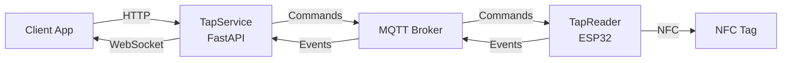

# LibreTap

Open-source NFC authentication system with ESP32 readers and FastAPI backend.

## Overview

LibreTap enables secure NFC card authentication through a distributed architecture:
- **ESP32 NFC readers** handle tag operations (read, register, authenticate)
- **FastAPI service** provides HTTP/WebSocket API for client applications
- **MQTT protocol** coordinates state between devices and service

Devices are authoritative — the service synchronizes state via MQTT confirmations rather than directly controlling hardware.

## Components

- **`mqtt-protocol/`**: Protocol specification with JSON schemas and message flows
- **`TapService/`**: Python FastAPI gateway (requires Python 3.12 + `uv`)
- **`TapReader/`**: ESP32 firmware (C++, built with PlatformIO)

## Quick Start

### MQTT Broker
```bash
# Using Docker (EMQX)
docker run -d --name emqx \
  -p 1883:1883 \
  emqx/emqx:latest

# Or use Mosquitto (may need additional configuration)
docker run -d --name mosquitto \
  -p 1883:1883 \
  eclipse-mosquitto:latest
```

### TapService (Backend)
```bash
cd TapService
uv sync
uv run uvicorn tapservice.main:app --reload
# Visit http://localhost:8000/docs for API documentation
```

### TapReader (Firmware)
```bash
cd TapReader
pio run                  # Build firmware
pio run --target upload  # Flash to ESP32
pio device monitor       # View serial output
```

## Architecture



**Flow:** Client sends HTTP command → Service publishes MQTT → Device executes → Device confirms via MQTT → Service broadcasts WebSocket event

Devices are authoritative—service synchronizes state based on device confirmations.

## Current Version: 1.0

**Authentication Model**: Shared secret (symmetric key stored on NFC tag)

See `mqtt-protocol/ROADMAP.md` for planned v2.0 features (challenge-response, keypair authentication).

## Documentation

- [MQTT Protocol Spec](mqtt-protocol/MQTT_PROTOCOL_SPEC.md) - Complete protocol documentation
- Component READMEs: [TapService](TapService/README.md) | [TapReader](TapReader/README.md) | [Protocol](mqtt-protocol/README.md)